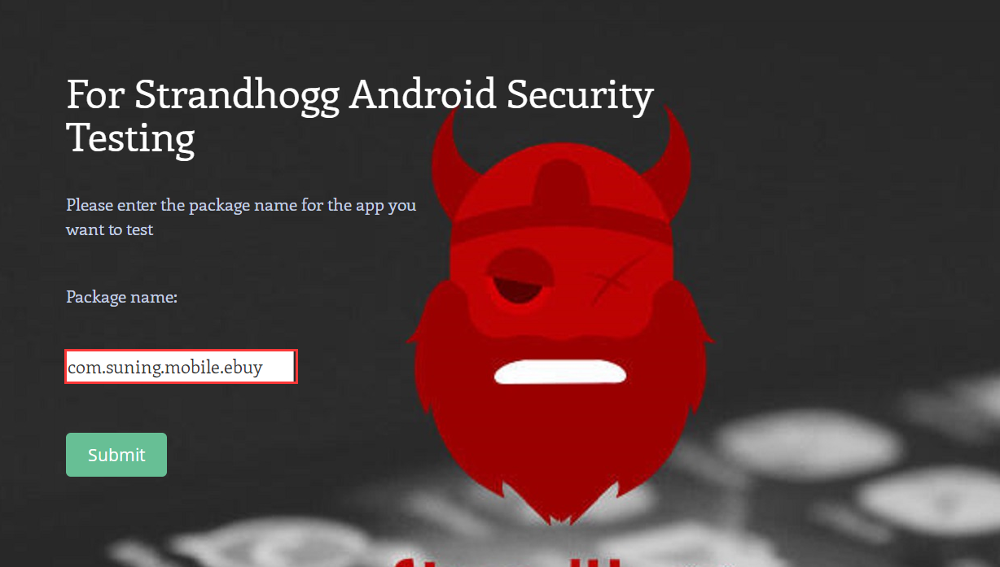
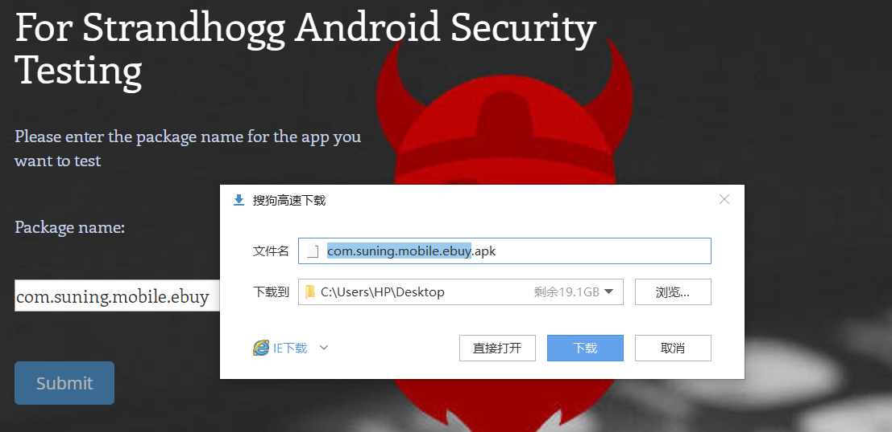
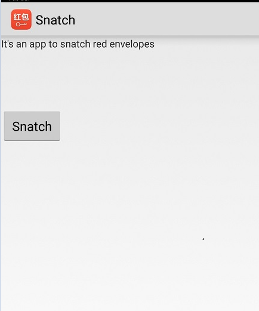

# Strandhogg_test

A more convenient way to test Stranghogg vulnerability
## Steps

1. Access the link http://8.129.65.130:8080/first_web/
2. Enter the Package Name for the app which is going to be tested. For example, the package name of the app was tested here is "com.suning.mobile.ebuy". And then click the Submit button.

3. Just wait for a while as the service is generating the new app for your request.
4. Download the app, the app will be named with the package name you provided.

5. Install the app you just downloaded.
6. Enter the app and then click the Snatch button. The app will run in background.

7. Click the app which is going to be tested. 

8. If "YOU HABE BEEN HACKED" appears, then it means the Stranghogg vulnerability exists in the app you tested. 
Otherwise, the Strandhogg vulnerability doesn't exist.

